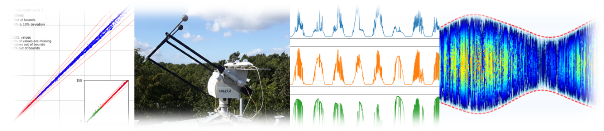

# Introduction

AssessingSolar is a practical guide to solar resource assessment in Python, aiming to make it easy to obtain solar radiation data, apply radiation models, and make accurate forecasts. The development of this guide is a collaborative effort within the IEA Photovoltaic Power Systems Programme (PVPS) [Task 16](https://www.iea-pvps.org/research-tasks/solar-resource-for-high-penetration-and-large-scale-applications/contacts_t16/).

Contrary to traditional textbooks or scientific articles, this guide presents the various topics of solar resource assessment with interactive plots and documented how-to examples using Python code. This is achieved using Jupyter Notebooks, which permits seamless integration of explanatory text, code examples, figures, mathematical equations, and references. The Python programming language was chosen as it is open-source, easy to learn, and the primary choice for the majority of [open-source solar and PV libraries](https://openpvtools.readthedocs.io), including [pvlib](https://pvlib-python.readthedocs.io/en/stable/), which is extensively used throughout this guide.

## How to contribute
We happily welcome contributions! You can either make a pull request, open an issue, or write to arajen@dtu.dk with any comments or suggestions.

## Feedback
We're always looking for ways to improve this website, so we hope that you will help us out by filling out this [1-min user survey](https://forms.gle/pdfSskT7LYN5L5do9). You can write any suggestions for improvements or corrections. Even if you don't have any comments, we would highly appreciate getting some statistics on our users to target our content.
